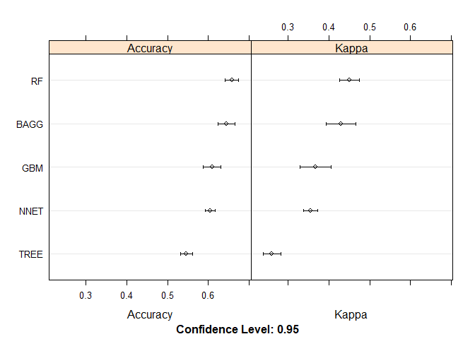
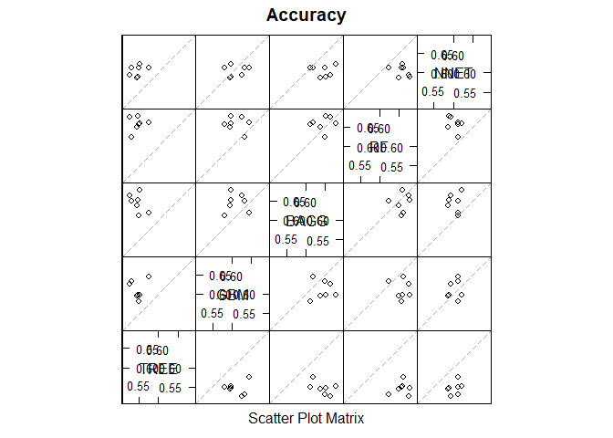
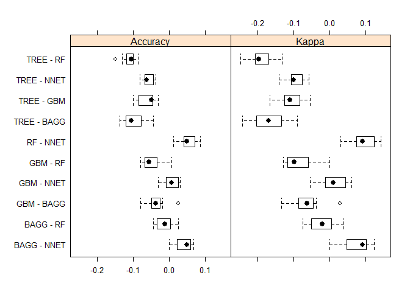
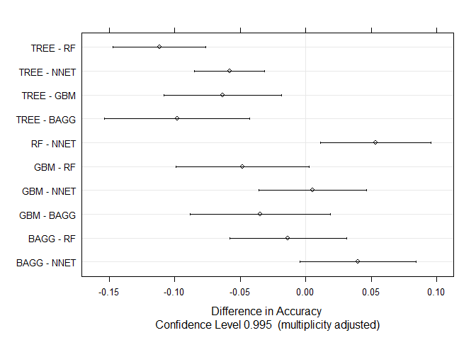
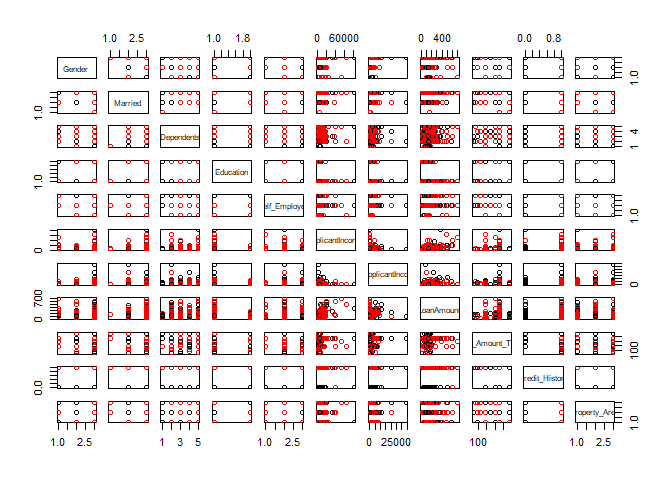
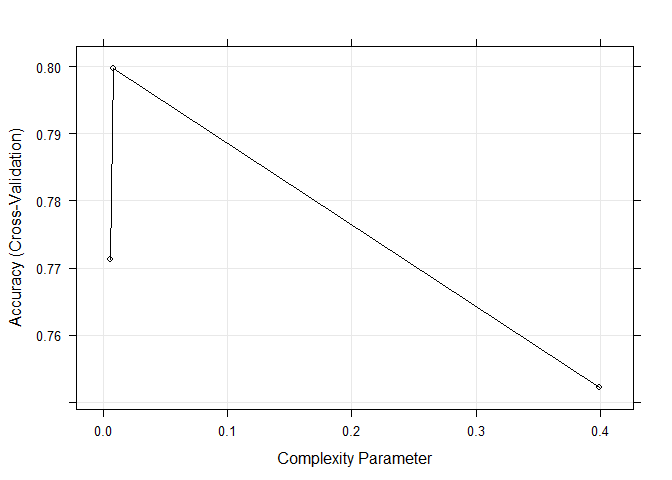
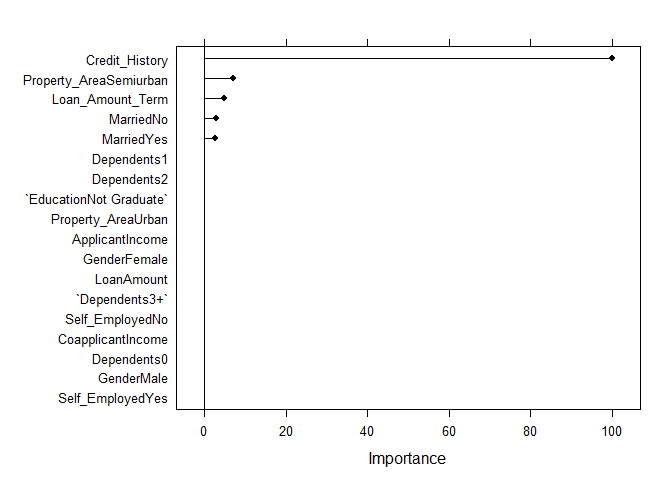
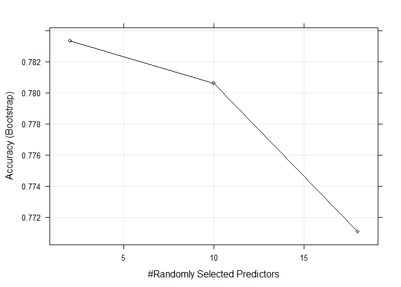

### References
How to do a reproducible document:  
[>  Markdown Basics](https://rmarkdown.rstudio.com/authoring_basics.html)  
[>  R Reference Card](https://cran.r-project.org/doc/contrib/Short-refcard.pdf)  
[>  The caret Package](https://topepo.github.io/caret/index.html)

How to obtain data:  
[> 24 Ultimate Data Science Projects To Boost Your Knowledge and Skills](https://www.analyticsvidhya.com/blog/2018/05/24-ultimate-data-science-projects-to-boost-your-knowledge-and-skills/)  
[>  The UCI Machine Learning Repository](http://archive.ics.uci.edu/ml/datasets.html)  


### Load data and libraries
[About data](http://archive.ics.uci.edu/ml/datasets/Wine+Quality)

```r
library(ggplot2)      # graphics
library(lattice)      # graphics
library(rattle)       # nice tree plot
library(caret)        # ML library
library(rpart)        # trees
library(gbm)          # boosted trees
library(ipred); library(e1071); library(plyr) # bagged trees
library(randomForest) # random forest
library(nnet)         # neural networks

## read data from URLs
url1 <- "http://archive.ics.uci.edu/ml/machine-learning-databases/wine-quality/winequality-red.csv"
url2 <- "http://archive.ics.uci.edu/ml/machine-learning-databases/wine-quality/winequality-white.csv"
data_red <- read.csv(file = url(url1), sep = ";")
data_white <- read.csv(file = url(url2), sep = ";")

## dimensions of data
dim(data_red)
```

```
## [1] 1599   12
```

```r
dim(data_white)
```

```
## [1] 4898   12
```

Input variables (based on physicochemical tests):  

1. fixed acidity  
2. volatile acidity  
3. citric acid  
4. residual sugar  
5. chlorides  
6. free sulfur dioxide  
7. total sulfur dioxide  
8. density  
9. pH  
10. sulphates  
11. alcohol  

Output variable (based on sensory data):  

+ 12. quality (score between 0 and 10)


# Research question

+ **Q:** From what parameters depends the quality of red wine?
+ **Classification problem:** quality is categorical (factor, mark)

```r
## only red wine
data <- data_red

## convert predicted outcome into factor variable
data$quality <- as.factor(data$quality)
```

+ I picked data about red wine because I like red wine more. :) 
+ If you are interested in white whine, use `data <- data_white`. 
+ It is also possible to mix data together by using `data <- rbind(data_red, data_white)` but this depends on data and research question.

Then, Approach is almost the same.


# Key idea of each ML algorithm

+ First, we **split data** into training and testing dataset,
+ then, we use training data for exploration and **train a model**
+ at the end, we **evaluate model** on testing dataset.


```r
## do a split
set.seed(1111)
inTrain <- createDataPartition(y = data$quality, p = 0.7, list = F)
training <- data[inTrain,]
testing <- data[-inTrain,]

## check dimensions
dim(training)
```

```
## [1] 1122   12
```

```r
dim(testing)
```

```
## [1] 477  12
```
*Note:* I use `set.seed()` because of reproducibility - same results, but still random.


# Exploration

```r
## info about data
head(x = training, n = 5)
```

```
##   fixed.acidity volatile.acidity citric.acid residual.sugar chlorides
## 3           7.8             0.76        0.04            2.3     0.092
## 4          11.2             0.28        0.56            1.9     0.075
## 5           7.4             0.70        0.00            1.9     0.076
## 7           7.9             0.60        0.06            1.6     0.069
## 8           7.3             0.65        0.00            1.2     0.065
##   free.sulfur.dioxide total.sulfur.dioxide density   pH sulphates alcohol
## 3                  15                   54  0.9970 3.26      0.65     9.8
## 4                  17                   60  0.9980 3.16      0.58     9.8
## 5                  11                   34  0.9978 3.51      0.56     9.4
## 7                  15                   59  0.9964 3.30      0.46     9.4
## 8                  15                   21  0.9946 3.39      0.47    10.0
##   quality
## 3       5
## 4       6
## 5       5
## 7       5
## 8       7
```

```r
str(training)
```

```
## 'data.frame':	1122 obs. of  12 variables:
##  $ fixed.acidity       : num  7.8 11.2 7.4 7.9 7.3 7.8 6.7 5.6 7.8 8.5 ...
##  $ volatile.acidity    : num  0.76 0.28 0.7 0.6 0.65 0.58 0.58 0.615 0.61 0.28 ...
##  $ citric.acid         : num  0.04 0.56 0 0.06 0 0.02 0.08 0 0.29 0.56 ...
##  $ residual.sugar      : num  2.3 1.9 1.9 1.6 1.2 2 1.8 1.6 1.6 1.8 ...
##  $ chlorides           : num  0.092 0.075 0.076 0.069 0.065 0.073 0.097 0.089 0.114 0.092 ...
##  $ free.sulfur.dioxide : num  15 17 11 15 15 9 15 16 9 35 ...
##  $ total.sulfur.dioxide: num  54 60 34 59 21 18 65 59 29 103 ...
##  $ density             : num  0.997 0.998 0.998 0.996 0.995 ...
##  $ pH                  : num  3.26 3.16 3.51 3.3 3.39 3.36 3.28 3.58 3.26 3.3 ...
##  $ sulphates           : num  0.65 0.58 0.56 0.46 0.47 0.57 0.54 0.52 1.56 0.75 ...
##  $ alcohol             : num  9.8 9.8 9.4 9.4 10 9.5 9.2 9.9 9.1 10.5 ...
##  $ quality             : Factor w/ 6 levels "3","4","5","6",..: 3 4 3 3 5 5 3 3 3 5 ...
```

```r
summary(training)
```

```
##  fixed.acidity    volatile.acidity  citric.acid     residual.sugar  
##  Min.   : 4.600   Min.   :0.1200   Min.   :0.0000   Min.   : 0.900  
##  1st Qu.: 7.100   1st Qu.:0.4000   1st Qu.:0.0900   1st Qu.: 1.900  
##  Median : 7.850   Median :0.5200   Median :0.2500   Median : 2.200  
##  Mean   : 8.274   Mean   :0.5255   Mean   :0.2654   Mean   : 2.516  
##  3rd Qu.: 9.100   3rd Qu.:0.6300   3rd Qu.:0.4200   3rd Qu.: 2.600  
##  Max.   :15.900   Max.   :1.5800   Max.   :1.0000   Max.   :15.500  
##    chlorides       free.sulfur.dioxide total.sulfur.dioxide
##  Min.   :0.01200   Min.   : 1.00       Min.   :  6.00      
##  1st Qu.:0.07100   1st Qu.: 8.00       1st Qu.: 23.00      
##  Median :0.07900   Median :14.00       Median : 38.00      
##  Mean   :0.08683   Mean   :15.83       Mean   : 45.93      
##  3rd Qu.:0.09000   3rd Qu.:21.00       3rd Qu.: 61.00      
##  Max.   :0.61000   Max.   :72.00       Max.   :160.00      
##     density             pH          sulphates         alcohol      quality
##  Min.   :0.9901   Min.   :2.740   Min.   :0.3300   Min.   : 8.40   3:  7  
##  1st Qu.:0.9956   1st Qu.:3.210   1st Qu.:0.5500   1st Qu.: 9.50   4: 38  
##  Median :0.9967   Median :3.320   Median :0.6200   Median :10.20   5:477  
##  Mean   :0.9967   Mean   :3.316   Mean   :0.6556   Mean   :10.43   6:447  
##  3rd Qu.:0.9978   3rd Qu.:3.408   3rd Qu.:0.7200   3rd Qu.:11.09   7:140  
##  Max.   :1.0037   Max.   :3.900   Max.   :2.0000   Max.   :14.90   8: 13
```

```r
## plot matrix
plot(training[,-12], col = training$quality)
```


```r
## plot - alcohol vs. volatile.acidity
qplot(x = alcohol, y = volatile.acidity, data = training, col = quality, alpha=I(0.5))
```


We have too many categories for quality variable, so let's look only for data with `quality = 5 or 6 or 7` because here is the **most of information**.

```r
## reduced data
data_reduced <- training[training$quality==5 | training$quality==6 | training$quality==7,]

## plot matrix
plot(data_reduced[,-12], col = data_reduced$quality)
```


```r
## plot - alcohol vs. volatile.acidity
g1 <- qplot(x = alcohol, y = volatile.acidity, data = data_reduced, col = quality, alpha=I(0.5))
g1
```


We can check, if some variable has **near zero variance**. If yes, we can omit this variable from the model building.  
We can also check, if some variable is **corelated** with other, and thus can be also omited.

```r
## near zero variance
nzv(training, saveMetrics = TRUE)
```

```
##                      freqRatio percentUnique zeroVar   nzv
## fixed.acidity         1.186047     8.2887701   FALSE FALSE
## volatile.acidity      1.032258    11.8538324   FALSE FALSE
## citric.acid           1.956522     7.0409982   FALSE FALSE
## residual.sugar        1.147368     7.3083779   FALSE FALSE
## chlorides             1.142857    11.7647059   FALSE FALSE
## free.sulfur.dioxide   1.313433     4.8128342   FALSE FALSE
## total.sulfur.dioxide  1.107143    12.1212121   FALSE FALSE
## density               1.076923    33.1550802   FALSE FALSE
## pH                    1.000000     7.6648841   FALSE FALSE
## sulphates             1.020000     7.8431373   FALSE FALSE
## alcohol               1.500000     5.3475936   FALSE FALSE
## quality               1.067114     0.5347594   FALSE FALSE
```

```r
## corelations
M <- cor(training[,-12])
M
```

```
##                      fixed.acidity volatile.acidity citric.acid
## fixed.acidity           1.00000000     -0.275934018  0.67176315
## volatile.acidity       -0.27593402      1.000000000 -0.55669149
## citric.acid             0.67176315     -0.556691487  1.00000000
## residual.sugar          0.10062188     -0.024922327  0.15571663
## chlorides               0.10077627      0.058282726  0.21316724
## free.sulfur.dioxide    -0.15259478     -0.027427532 -0.05891054
## total.sulfur.dioxide   -0.10195935      0.058879953  0.03322388
## density                 0.65045803      0.002696194  0.37117207
## pH                     -0.66774144      0.232876684 -0.52748082
## sulphates               0.17040032     -0.247058422  0.29449067
## alcohol                -0.03090026     -0.203528604  0.11673613
##                      residual.sugar   chlorides free.sulfur.dioxide
## fixed.acidity           0.100621878  0.10077627         -0.15259478
## volatile.acidity       -0.024922327  0.05828273         -0.02742753
## citric.acid             0.155716632  0.21316724         -0.05891054
## residual.sugar          1.000000000  0.06058153          0.18482025
## chlorides               0.060581526  1.00000000          0.03113920
## free.sulfur.dioxide     0.184820250  0.03113920          1.00000000
## total.sulfur.dioxide    0.182089768  0.07027945          0.64721443
## density                 0.348203406  0.21041447         -0.01042776
## pH                     -0.064354479 -0.28731402          0.07778272
## sulphates              -0.004694396  0.37816704          0.06541904
## alcohol                 0.054287117 -0.21398677         -0.07033256
##                      total.sulfur.dioxide      density          pH
## fixed.acidity                 -0.10195935  0.650458032 -0.66774144
## volatile.acidity               0.05887995  0.002696194  0.23287668
## citric.acid                    0.03322388  0.371172069 -0.52748082
## residual.sugar                 0.18208977  0.348203406 -0.06435448
## chlorides                      0.07027945  0.210414473 -0.28731402
## free.sulfur.dioxide            0.64721443 -0.010427764  0.07778272
## total.sulfur.dioxide           1.00000000  0.113284506 -0.07269281
## density                        0.11328451  1.000000000 -0.31348267
## pH                            -0.07269281 -0.313482671  1.00000000
## sulphates                      0.07511224  0.134721550 -0.22835743
## alcohol                       -0.23609439 -0.488612508  0.17689297
##                         sulphates     alcohol
## fixed.acidity         0.170400321 -0.03090026
## volatile.acidity     -0.247058422 -0.20352860
## citric.acid           0.294490668  0.11673613
## residual.sugar       -0.004694396  0.05428712
## chlorides             0.378167041 -0.21398677
## free.sulfur.dioxide   0.065419035 -0.07033256
## total.sulfur.dioxide  0.075112241 -0.23609439
## density               0.134721550 -0.48861251
## pH                   -0.228357427  0.17689297
## sulphates             1.000000000  0.08862458
## alcohol               0.088624580  1.00000000
```

```r
M <- round(abs(M), digits = 2)
diag(M) <- 0
max(M)
```

```
## [1] 0.67
```


# Prediction

### Guessing of some "areas" in graph with dominant quality  
Some magic :)

```r
g1 + geom_vline(xintercept = 10.25) 
```


## 1. Decision trees
First of all, we will try a tree - easy and interpretable model. We use `rpart` library.

```r
## build model - tree
model_tree <- train(quality ~., data = training, method="rpart")
```

Here is information about model. Accuracy of this model on training data is **0.5499**.

```r
## model info
model_tree
```

```
## CART 
## 
## 1122 samples
##   11 predictor
##    6 classes: '3', '4', '5', '6', '7', '8' 
## 
## No pre-processing
## Resampling: Bootstrapped (25 reps) 
## Summary of sample sizes: 1122, 1122, 1122, 1122, 1122, 1122, ... 
## Resampling results across tuning parameters:
## 
##   cp          Accuracy   Kappa    
##   0.01550388  0.5498849  0.2627684
##   0.01627907  0.5491054  0.2611397
##   0.23100775  0.5004796  0.1483496
## 
## Accuracy was used to select the optimal model using the largest value.
## The final value used for the model was cp = 0.01550388.
```

```r
## plot - accuracy vs. tuning parameter (cp)
plot(model_tree)
```


```r
## importance of variables in the model
varImp(object = model_tree)
```

```
## rpart variable importance
## 
##                      Overall
## alcohol              100.000
## sulphates             59.512
## volatile.acidity      55.570
## total.sulfur.dioxide  47.401
## density               34.397
## citric.acid           26.880
## free.sulfur.dioxide   12.287
## fixed.acidity          7.921
## pH                     5.715
## chlorides              0.000
## residual.sugar         0.000
```

```r
plot(varImp(model_tree))
```


Decisions from the tree are:

```r
## tree
model_tree$finalModel
```

```
## n= 1122 
## 
## node), split, n, loss, yval, (yprob)
##       * denotes terminal node
## 
##  1) root 1122 645 5 (0.0062 0.034 0.43 0.4 0.12 0.012)  
##    2) alcohol< 10.25 578 222 5 (0.0087 0.038 0.62 0.31 0.028 0.0035) *
##    3) alcohol>=10.25 544 274 6 (0.0037 0.029 0.22 0.5 0.23 0.02)  
##      6) volatile.acidity>=0.3975 352 163 6 (0.0057 0.043 0.27 0.54 0.13 0.017) *
##      7) volatile.acidity< 0.3975 192 111 6 (0 0.0052 0.14 0.42 0.41 0.026)  
##       14) total.sulfur.dioxide>=49.5 43  15 6 (0 0.023 0.21 0.65 0.093 0.023) *
##       15) total.sulfur.dioxide< 49.5 149  75 7 (0 0 0.12 0.36 0.5 0.027) *
```

```r
fancyRpartPlot(model = model_tree$finalModel)
```


```r
## percentages in the tree
table(training$quality) / nrow(training)
```

```
## 
##           3           4           5           6           7           8 
## 0.006238859 0.033868093 0.425133690 0.398395722 0.124777184 0.011586453
```

But this model can be overfitted on training dataset (building the model on training data), so we need to check for **accuracy in testing dataset** (independent data from the model).

```r
## predictions of quality on testing data
pred_tree <- predict(object = model_tree, newdata = testing)

## compare real quality with predicted values
confusionMatrix(data = pred_tree, reference = testing$quality)
```

```
## Confusion Matrix and Statistics
## 
##           Reference
## Prediction   3   4   5   6   7   8
##          3   0   0   0   0   0   0
##          4   0   0   0   0   0   0
##          5   2   7 163  83   9   0
##          6   1   7  38  76  30   2
##          7   0   1   3  32  20   3
##          8   0   0   0   0   0   0
## 
## Overall Statistics
##                                           
##                Accuracy : 0.543           
##                  95% CI : (0.4971, 0.5883)
##     No Information Rate : 0.4277          
##     P-Value [Acc > NIR] : 2.704e-07       
##                                           
##                   Kappa : 0.2613          
##  Mcnemar's Test P-Value : NA              
## 
## Statistics by Class:
## 
##                      Class: 3 Class: 4 Class: 5 Class: 6 Class: 7 Class: 8
## Sensitivity          0.000000  0.00000   0.7990   0.3979  0.33898  0.00000
## Specificity          1.000000  1.00000   0.6300   0.7273  0.90670  1.00000
## Pos Pred Value            NaN      NaN   0.6174   0.4935  0.33898      NaN
## Neg Pred Value       0.993711  0.96855   0.8075   0.6440  0.90670  0.98952
## Prevalence           0.006289  0.03145   0.4277   0.4004  0.12369  0.01048
## Detection Rate       0.000000  0.00000   0.3417   0.1593  0.04193  0.00000
## Detection Prevalence 0.000000  0.00000   0.5535   0.3229  0.12369  0.00000
## Balanced Accuracy    0.500000  0.50000   0.7145   0.5626  0.62284  0.50000
```

Accuracy on testing data is unbalanced with accuracy of the model (builded on training data).


### 1a. Decision tree with Cross-validation
Now, we use **7-fold cross-validation** for building a model. The advantage is reduction of overfitting.

```r
set.seed(1234)
model_tree_cv7 <- train(quality ~., data = training, 
                        method="rpart", 
                        trControl = trainControl("cv", number = 7))
model_tree_cv7
```

```
## CART 
## 
## 1122 samples
##   11 predictor
##    6 classes: '3', '4', '5', '6', '7', '8' 
## 
## No pre-processing
## Resampling: Cross-Validated (7 fold) 
## Summary of sample sizes: 962, 962, 962, 962, 961, 961, ... 
## Resampling results across tuning parameters:
## 
##   cp          Accuracy   Kappa    
##   0.01550388  0.5463398  0.2606196
##   0.01627907  0.5409827  0.2566354
##   0.23100775  0.4794088  0.1050477
## 
## Accuracy was used to select the optimal model using the largest value.
## The final value used for the model was cp = 0.01550388.
```

```r
confusionMatrix(reference = testing$quality, data = predict(model_tree_cv7, testing))
```

```
## Confusion Matrix and Statistics
## 
##           Reference
## Prediction   3   4   5   6   7   8
##          3   0   0   0   0   0   0
##          4   0   0   0   0   0   0
##          5   2   7 163  83   9   0
##          6   1   7  38  76  30   2
##          7   0   1   3  32  20   3
##          8   0   0   0   0   0   0
## 
## Overall Statistics
##                                           
##                Accuracy : 0.543           
##                  95% CI : (0.4971, 0.5883)
##     No Information Rate : 0.4277          
##     P-Value [Acc > NIR] : 2.704e-07       
##                                           
##                   Kappa : 0.2613          
##  Mcnemar's Test P-Value : NA              
## 
## Statistics by Class:
## 
##                      Class: 3 Class: 4 Class: 5 Class: 6 Class: 7 Class: 8
## Sensitivity          0.000000  0.00000   0.7990   0.3979  0.33898  0.00000
## Specificity          1.000000  1.00000   0.6300   0.7273  0.90670  1.00000
## Pos Pred Value            NaN      NaN   0.6174   0.4935  0.33898      NaN
## Neg Pred Value       0.993711  0.96855   0.8075   0.6440  0.90670  0.98952
## Prevalence           0.006289  0.03145   0.4277   0.4004  0.12369  0.01048
## Detection Rate       0.000000  0.00000   0.3417   0.1593  0.04193  0.00000
## Detection Prevalence 0.000000  0.00000   0.5535   0.3229  0.12369  0.00000
## Balanced Accuracy    0.500000  0.50000   0.7145   0.5626  0.62284  0.50000
```

```r
fancyRpartPlot(model = model_tree_cv7$finalModel)
```


We also can check accuracy in each fold:

```r
model_tree_cv7$resample
```

```
##    Accuracy     Kappa Resample
## 1 0.5500000 0.2575406    Fold3
## 2 0.5312500 0.2690058    Fold2
## 3 0.5750000 0.3030555    Fold1
## 4 0.5437500 0.2480041    Fold4
## 5 0.5250000 0.2369478    Fold7
## 6 0.5527950 0.2384706    Fold6
## 7 0.5465839 0.2713125    Fold5
```

```r
# mean accuracy and kappa
apply(X = model_tree_cv7$resample[,1:2], MARGIN = 2, FUN = mean)
```

```
##  Accuracy     Kappa 
## 0.5463398 0.2606196
```


### 1b. Decision tree with preprocessing of data
We can also **preprocess data** before building any model. We saw some skewness of data in exploration, so we can try to scale the data.

```r
set.seed(1234)
model_tree_scaled <- train(quality ~., data = training, 
                           method="rpart", 
                           trControl = trainControl("cv", number = 7),
                           preProcess = "scale")
model_tree_scaled
```

```
## CART 
## 
## 1122 samples
##   11 predictor
##    6 classes: '3', '4', '5', '6', '7', '8' 
## 
## Pre-processing: scaled (11) 
## Resampling: Cross-Validated (7 fold) 
## Summary of sample sizes: 962, 962, 962, 962, 961, 961, ... 
## Resampling results across tuning parameters:
## 
##   cp          Accuracy   Kappa    
##   0.01550388  0.5463398  0.2606196
##   0.01627907  0.5409827  0.2566354
##   0.23100775  0.4794088  0.1050477
## 
## Accuracy was used to select the optimal model using the largest value.
## The final value used for the model was cp = 0.01550388.
```

```r
confusionMatrix(reference = testing$quality, data = predict(model_tree_scaled, testing))
```

```
## Confusion Matrix and Statistics
## 
##           Reference
## Prediction   3   4   5   6   7   8
##          3   0   0   0   0   0   0
##          4   0   0   0   0   0   0
##          5   2   7 163  83   9   0
##          6   1   7  38  76  30   2
##          7   0   1   3  32  20   3
##          8   0   0   0   0   0   0
## 
## Overall Statistics
##                                           
##                Accuracy : 0.543           
##                  95% CI : (0.4971, 0.5883)
##     No Information Rate : 0.4277          
##     P-Value [Acc > NIR] : 2.704e-07       
##                                           
##                   Kappa : 0.2613          
##  Mcnemar's Test P-Value : NA              
## 
## Statistics by Class:
## 
##                      Class: 3 Class: 4 Class: 5 Class: 6 Class: 7 Class: 8
## Sensitivity          0.000000  0.00000   0.7990   0.3979  0.33898  0.00000
## Specificity          1.000000  1.00000   0.6300   0.7273  0.90670  1.00000
## Pos Pred Value            NaN      NaN   0.6174   0.4935  0.33898      NaN
## Neg Pred Value       0.993711  0.96855   0.8075   0.6440  0.90670  0.98952
## Prevalence           0.006289  0.03145   0.4277   0.4004  0.12369  0.01048
## Detection Rate       0.000000  0.00000   0.3417   0.1593  0.04193  0.00000
## Detection Prevalence 0.000000  0.00000   0.5535   0.3229  0.12369  0.00000
## Balanced Accuracy    0.500000  0.50000   0.7145   0.5626  0.62284  0.50000
```
Scaling and centring have no impact on a model.
*Note:* We can use wide variety of preprocessing, e.g. `PCA, scaling, centring, knnImpute, BoxCox,` ...


## 2. Improvement of trees
### 2a. Boosted with trees
Gradient boosting method. Idea of boosting is to do a **linear combination of predictors**.

```r
## build model - boosted
set.seed(1234)
model_gbm <- train(quality ~., data = training, 
                   method="gbm", 
                   trControl = trainControl("cv", number = 7))
```


```r
## info about model
model_gbm
```

```
## Stochastic Gradient Boosting 
## 
## 1122 samples
##   11 predictor
##    6 classes: '3', '4', '5', '6', '7', '8' 
## 
## No pre-processing
## Resampling: Cross-Validated (7 fold) 
## Summary of sample sizes: 962, 962, 962, 962, 961, 961, ... 
## Resampling results across tuning parameters:
## 
##   interaction.depth  n.trees  Accuracy   Kappa    
##   1                   50      0.6096495  0.3675336
##   1                  100      0.5944654  0.3434867
##   1                  150      0.5882209  0.3372539
##   2                   50      0.5962844  0.3474651
##   2                  100      0.5998336  0.3565301
##   2                  150      0.5998281  0.3569738
##   3                   50      0.5944931  0.3444141
##   3                  100      0.5962788  0.3515094
##   3                  150      0.6034051  0.3660699
## 
## Tuning parameter 'shrinkage' was held constant at a value of 0.1
## 
## Tuning parameter 'n.minobsinnode' was held constant at a value of 10
## Accuracy was used to select the optimal model using the largest value.
## The final values used for the model were n.trees = 50, interaction.depth
##  = 1, shrinkage = 0.1 and n.minobsinnode = 10.
```

```r
plot(model_gbm)
```


```r
summary(model_gbm)
```


```
##                                       var    rel.inf
## alcohol                           alcohol 62.6940668
## sulphates                       sulphates 14.8017686
## volatile.acidity         volatile.acidity 10.5267784
## total.sulfur.dioxide total.sulfur.dioxide  9.2773784
## pH                                     pH  1.8868529
## fixed.acidity               fixed.acidity  0.4096771
## chlorides                       chlorides  0.2517895
## residual.sugar             residual.sugar  0.1516883
## citric.acid                   citric.acid  0.0000000
## free.sulfur.dioxide   free.sulfur.dioxide  0.0000000
## density                           density  0.0000000
```

```r
## acc on testing data
confusionMatrix(reference = testing$quality, data = predict(model_gbm, testing))
```

```
## Confusion Matrix and Statistics
## 
##           Reference
## Prediction   3   4   5   6   7   8
##          3   0   0   0   0   0   0
##          4   1   1   2   1   0   0
##          5   2   8 164  62   5   0
##          6   0   5  38 107  28   4
##          7   0   1   0  20  26   1
##          8   0   0   0   1   0   0
## 
## Overall Statistics
##                                           
##                Accuracy : 0.6247          
##                  95% CI : (0.5796, 0.6683)
##     No Information Rate : 0.4277          
##     P-Value [Acc > NIR] : < 2.2e-16       
##                                           
##                   Kappa : 0.3931          
##  Mcnemar's Test P-Value : NA              
## 
## Statistics by Class:
## 
##                      Class: 3 Class: 4 Class: 5 Class: 6 Class: 7 Class: 8
## Sensitivity          0.000000 0.066667   0.8039   0.5602  0.44068 0.000000
## Specificity          1.000000 0.991342   0.7179   0.7378  0.94737 0.997881
## Pos Pred Value            NaN 0.200000   0.6805   0.5879  0.54167 0.000000
## Neg Pred Value       0.993711 0.970339   0.8305   0.7153  0.92308 0.989496
## Prevalence           0.006289 0.031447   0.4277   0.4004  0.12369 0.010482
## Detection Rate       0.000000 0.002096   0.3438   0.2243  0.05451 0.000000
## Detection Prevalence 0.000000 0.010482   0.5052   0.3816  0.10063 0.002096
## Balanced Accuracy    0.500000 0.529004   0.7609   0.6490  0.69402 0.498941
```

### 2b. Bagged trees
*Note:* Bagging = Bootstrap Aggregation

Idea of bagging is bootstrap - **calculate model on resamples** and take the average model (same bias, less variability).

```r
set.seed(1234)
model_treebag <- train(quality ~., data = training, 
                       method="treebag", 
                       trControl = trainControl("cv", number = 7))

## info about model
model_treebag
```

```
## Bagged CART 
## 
## 1122 samples
##   11 predictor
##    6 classes: '3', '4', '5', '6', '7', '8' 
## 
## No pre-processing
## Resampling: Cross-Validated (7 fold) 
## Summary of sample sizes: 962, 962, 962, 962, 961, 961, ... 
## Resampling results:
## 
##   Accuracy   Kappa    
##   0.6443489  0.4296151
```

```r
model_treebag$finalModel
```

```
## 
## Bagging classification trees with 25 bootstrap replications
```

```r
## acc on testing data
confusionMatrix(reference = testing$quality, data = predict(model_treebag, testing))
```

```
## Confusion Matrix and Statistics
## 
##           Reference
## Prediction   3   4   5   6   7   8
##          3   0   0   1   0   0   0
##          4   1   0   1   2   0   0
##          5   2  10 163  42   3   0
##          6   0   3  39 124  20   2
##          7   0   2   0  22  36   2
##          8   0   0   0   1   0   1
## 
## Overall Statistics
##                                          
##                Accuracy : 0.6792         
##                  95% CI : (0.6353, 0.721)
##     No Information Rate : 0.4277         
##     P-Value [Acc > NIR] : < 2.2e-16      
##                                          
##                   Kappa : 0.4897         
##  Mcnemar's Test P-Value : NA             
## 
## Statistics by Class:
## 
##                      Class: 3 Class: 4 Class: 5 Class: 6 Class: 7 Class: 8
## Sensitivity          0.000000 0.000000   0.7990   0.6492  0.61017 0.200000
## Specificity          0.997890 0.991342   0.7912   0.7762  0.93780 0.997881
## Pos Pred Value       0.000000 0.000000   0.7409   0.6596  0.58065 0.500000
## Neg Pred Value       0.993697 0.968288   0.8405   0.7682  0.94458 0.991579
## Prevalence           0.006289 0.031447   0.4277   0.4004  0.12369 0.010482
## Detection Rate       0.000000 0.000000   0.3417   0.2600  0.07547 0.002096
## Detection Prevalence 0.002096 0.008386   0.4612   0.3941  0.12998 0.004193
## Balanced Accuracy    0.498945 0.495671   0.7951   0.7127  0.77398 0.598941
```


## 3. Random forest

```r
## build model - random forest
set.seed(1234)
model_rf <- train(quality ~., data = training, 
                  method="rf", 
                  trControl = trainControl("cv", number = 7))

## info about model
model_rf
```

```
## Random Forest 
## 
## 1122 samples
##   11 predictor
##    6 classes: '3', '4', '5', '6', '7', '8' 
## 
## No pre-processing
## Resampling: Cross-Validated (7 fold) 
## Summary of sample sizes: 962, 962, 962, 962, 961, 961, ... 
## Resampling results across tuning parameters:
## 
##   mtry  Accuracy   Kappa    
##    2    0.6524179  0.4351180
##    6    0.6488188  0.4331051
##   11    0.6577362  0.4507108
## 
## Accuracy was used to select the optimal model using the largest value.
## The final value used for the model was mtry = 11.
```

```r
plot(model_rf)
```


```r
varImp(model_rf)
```

```
## rf variable importance
## 
##                      Overall
## alcohol              100.000
## sulphates             46.872
## volatile.acidity      43.620
## total.sulfur.dioxide  39.899
## chlorides             14.884
## density               11.450
## pH                    11.363
## citric.acid            8.121
## residual.sugar         8.116
## fixed.acidity          4.693
## free.sulfur.dioxide    0.000
```

```r
## acc on testing data
confusionMatrix(reference = testing$quality, data = predict(model_rf, testing))
```

```
## Confusion Matrix and Statistics
## 
##           Reference
## Prediction   3   4   5   6   7   8
##          3   0   0   0   0   0   0
##          4   1   0   1   1   0   0
##          5   1   8 169  39   4   0
##          6   1   6  34 131  18   2
##          7   0   1   0  20  37   2
##          8   0   0   0   0   0   1
## 
## Overall Statistics
##                                          
##                Accuracy : 0.7086         
##                  95% CI : (0.6656, 0.749)
##     No Information Rate : 0.4277         
##     P-Value [Acc > NIR] : < 2.2e-16      
##                                          
##                   Kappa : 0.5337         
##  Mcnemar's Test P-Value : NA             
## 
## Statistics by Class:
## 
##                      Class: 3 Class: 4 Class: 5 Class: 6 Class: 7 Class: 8
## Sensitivity          0.000000 0.000000   0.8284   0.6859  0.62712 0.200000
## Specificity          1.000000 0.993506   0.8095   0.7867  0.94498 1.000000
## Pos Pred Value            NaN 0.000000   0.7647   0.6823  0.61667 1.000000
## Neg Pred Value       0.993711 0.968354   0.8633   0.7895  0.94724 0.991597
## Prevalence           0.006289 0.031447   0.4277   0.4004  0.12369 0.010482
## Detection Rate       0.000000 0.000000   0.3543   0.2746  0.07757 0.002096
## Detection Prevalence 0.000000 0.006289   0.4633   0.4025  0.12579 0.002096
## Balanced Accuracy    0.500000 0.496753   0.8190   0.7363  0.78605 0.600000
```

We can check of how many trees are in the forest or check some tree:

+ left daughter	-- the row where the left daughter node is; 0 if the node is terminal  
+ right daughter -- the row where the right daughter node is; 0 if the node is terminal  
+ split var	-- which variable was used to split the node; 0 if the node is terminal  
+ split point	-- where the best split is; see Details for categorical predictor  
+ status-- is the node terminal (-1) or not (1)  
+ prediction -- the prediction for the node; 0 if the node is not terminal  

```r
## number of trees in rf
model_rf$finalModel
```

```
## 
## Call:
##  randomForest(x = x, y = y, mtry = param$mtry) 
##                Type of random forest: classification
##                      Number of trees: 500
## No. of variables tried at each split: 11
## 
##         OOB estimate of  error rate: 33.87%
## Confusion matrix:
##   3 4   5   6  7 8 class.error
## 3 0 1   5   1  0 0   1.0000000
## 4 1 3  27   7  0 0   0.9210526
## 5 0 3 362 103  9 0   0.2410901
## 6 0 1 103 306 37 0   0.3154362
## 7 0 0  12  56 71 1   0.4928571
## 8 0 0   0   8  5 0   1.0000000
```

```r
## 155th tree in rf (show only head of 20 rows)
tree155 <- getTree(rfobj = model_rf$finalModel, k=155)
dim(tree155)
```

```
## [1] 415   6
```

```r
head(x = tree155, n = 20)
```

```
##    left daughter right daughter split var split point status prediction
## 1              2              3        11      10.050      1          0
## 2              4              5         2       0.345      1          0
## 3              6              7         2       0.335      1          0
## 4              8              9         3       0.405      1          0
## 5             10             11         7      51.500      1          0
## 6             12             13        11      10.450      1          0
## 7             14             15         2       0.865      1          0
## 8             16             17        11       9.250      1          0
## 9             18             19         6       4.500      1          0
## 10            20             21        10       0.595      1          0
## 11            22             23         7      94.500      1          0
## 12            24             25         9       3.210      1          0
## 13            26             27         4       1.650      1          0
## 14            28             29        11      11.450      1          0
## 15            30             31         3       0.160      1          0
## 16             0              0         0       0.000     -1          3
## 17            32             33         2       0.275      1          0
## 18             0              0         0       0.000     -1          3
## 19            34             35        10       0.665      1          0
## 20            36             37        11       9.150      1          0
```


Here is how the error rate depends on number of trees. 

```r
## plot - error
plot(model_rf$finalModel)
```


We can see that is not neccessary to have so many trees in forest. Next time we can specify argument `ntrees=100` into `train()` function and save time needed for model building.


## 4. Comparison with Neural networks
We can try to use neural network (which is "black box") to save the day.

```r
## build model - neural network
set.seed(1234)
model_nnet <- train(quality ~., data = training, 
                    method="nnet", 
                    trControl = trainControl("cv", number = 7))
```


```
## Neural Network 
## 
## 1122 samples
##   11 predictor
##    6 classes: '3', '4', '5', '6', '7', '8' 
## 
## No pre-processing
## Resampling: Cross-Validated (7 fold) 
## Summary of sample sizes: 962, 962, 962, 962, 961, 961, ... 
## Resampling results across tuning parameters:
## 
##   size  decay  Accuracy   Kappa     
##   1     0e+00  0.4483474  0.04742626
##   1     1e-04  0.4742402  0.09825886
##   1     1e-01  0.5436224  0.23296287
##   3     0e+00  0.4953804  0.14092653
##   3     1e-04  0.5382764  0.22700031
##   3     1e-01  0.5908995  0.33051869
##   5     0e+00  0.6042757  0.35564691
##   5     1e-04  0.5563221  0.26804597
##   5     1e-01  0.6007431  0.34806241
## 
## Accuracy was used to select the optimal model using the largest value.
## The final values used for the model were size = 5 and decay = 0.
```


```
## Confusion Matrix and Statistics
## 
##           Reference
## Prediction   3   4   5   6   7   8
##          3   0   0   0   0   0   0
##          4   0   0   0   0   0   0
##          5   3   9 163  62   5   0
##          6   0   5  41 111  36   2
##          7   0   1   0  18  18   3
##          8   0   0   0   0   0   0
## 
## Overall Statistics
##                                           
##                Accuracy : 0.6122          
##                  95% CI : (0.5668, 0.6561)
##     No Information Rate : 0.4277          
##     P-Value [Acc > NIR] : 4.28e-16        
##                                           
##                   Kappa : 0.3631          
##  Mcnemar's Test P-Value : NA              
## 
## Statistics by Class:
## 
##                      Class: 3 Class: 4 Class: 5 Class: 6 Class: 7 Class: 8
## Sensitivity          0.000000  0.00000   0.7990   0.5812  0.30508  0.00000
## Specificity          1.000000  1.00000   0.7106   0.7063  0.94737  1.00000
## Pos Pred Value            NaN      NaN   0.6736   0.5692  0.45000      NaN
## Neg Pred Value       0.993711  0.96855   0.8255   0.7163  0.90618  0.98952
## Prevalence           0.006289  0.03145   0.4277   0.4004  0.12369  0.01048
## Detection Rate       0.000000  0.00000   0.3417   0.2327  0.03774  0.00000
## Detection Prevalence 0.000000  0.00000   0.5073   0.4088  0.08386  0.00000
## Balanced Accuracy    0.500000  0.50000   0.7548   0.6437  0.62623  0.50000
```
Neural networks looks cool and complex, nobody understand it ... but some(many-)times results are worse.


## Impovements
### Impovement of predictors  

+ use functions on variables -- log, ...
+ change continuos variable into categorical, ...


### Impovement of model - tuning
We can set up **tuning parameters** of model **manualy** by using argument 
`tuneGrid = expand.grid(parameter1 = values1, parameter2 = values2, ...)` into `train()` function.

More info about tuning:
[The caret Package, cap.5: Model Training and Tuning](https://topepo.github.io/caret/model-training-and-tuning.html)


# Summary
More info about methods and more methods:
[The caret Package, cap.7: Train Models By Tag](https://topepo.github.io/caret/train-models-by-tag.html)

```r
## simple tree
confusionMatrix(testing$quality, predict(model_tree, testing))$overall[1]
```

```
##  Accuracy 
## 0.5429769
```

```r
## cross-validated tree


confusionMatrix(testing$quality, predict(model_tree_cv7, testing))$overall[1]
```

```
##  Accuracy 
## 0.5429769
```

```r
## scaled tree
confusionMatrix(testing$quality, predict(model_tree_scaled, testing))$overall[1]
```

```
##  Accuracy 
## 0.5429769
```

```r
## boosted tree
confusionMatrix(testing$quality, predict(model_gbm, testing))$overall[1]
```

```
##  Accuracy 
## 0.6247379
```

```r
## bagged tree
confusionMatrix(testing$quality, predict(model_treebag, testing))$overall[1]
```

```
##  Accuracy 
## 0.6792453
```

```r
## random forest
confusionMatrix(testing$quality, predict(model_rf, testing))$overall[1]
```

```
##  Accuracy 
## 0.7106918
```

```r
## neural network
confusionMatrix(testing$quality, predict(model_nnet, testing))$overall[1]
```

```
##  Accuracy 
## 0.6121593
```


### Comparing Between-Models
Given these models, can we make statistical statements about their performance differences? To do this, we first collect the resampling results using `resamples()`.

```r
## resampling results
resamps <- resamples(list(TREE = model_tree_cv7,
                          GBM  = model_gbm,
                          BAGG = model_treebag,
                          RF   = model_rf,
                          NNET = model_nnet))

## info about resamples
resamps
```

```
## 
## Call:
## resamples.default(x = list(TREE = model_tree_cv7, GBM = model_gbm, BAGG
##  = model_treebag, RF = model_rf, NNET = model_nnet))
## 
## Models: TREE, GBM, BAGG, RF, NNET 
## Number of resamples: 7 
## Performance metrics: Accuracy, Kappa 
## Time estimates for: everything, final model fit
```

```r
summary(resamps)
```

```
## 
## Call:
## summary.resamples(object = resamps)
## 
## Models: TREE, GBM, BAGG, RF, NNET 
## Number of resamples: 7 
## 
## Accuracy 
##         Min.   1st Qu.    Median      Mean   3rd Qu.      Max. NA's
## TREE 0.52500 0.5375000 0.5465839 0.5463398 0.5513975 0.5750000    0
## GBM  0.58125 0.5950116 0.5962733 0.6096495 0.6281250 0.6437500    0
## BAGG 0.61250 0.6281250 0.6500000 0.6443489 0.6573370 0.6770186    0
## RF   0.62500 0.6531250 0.6583851 0.6577362 0.6687500 0.6770186    0
## NNET 0.58750 0.5919061 0.6125000 0.6042757 0.6125000 0.6211180    0
## 
## Kappa 
##           Min.   1st Qu.    Median      Mean   3rd Qu.      Max. NA's
## TREE 0.2369478 0.2432374 0.2575406 0.2606196 0.2701592 0.3030555    0
## GBM  0.3123356 0.3428840 0.3480563 0.3675336 0.4022246 0.4221265    0
## BAGG 0.3662962 0.4109515 0.4318483 0.4296151 0.4525036 0.4822511    0
## RF   0.4007117 0.4428999 0.4556799 0.4507108 0.4635633 0.4856578    0
## NNET 0.3295476 0.3393108 0.3662152 0.3556469 0.3679898 0.3791643    0
```

```r
trellis.par.set(caretTheme())
bwplot(resamps)
```


```r
dotplot(resamps)
```



```r
splom(resamps)
```



```r
## differences of resamples
difValues <- diff(resamps)
difValues
```

```
## 
## Call:
## diff.resamples(x = resamps)
## 
## Models: TREE, GBM, BAGG, RF, NNET 
## Metrics: Accuracy, Kappa 
## Number of differences: 10 
## p-value adjustment: bonferroni
```

```r
## info about differences
summary(difValues)
```

```
## 
## Call:
## summary.diff.resamples(object = difValues)
## 
## p-value adjustment: bonferroni 
## Upper diagonal: estimates of the difference
## Lower diagonal: p-value for H0: difference = 0
## 
## Accuracy 
##      TREE      GBM       BAGG      RF        NNET     
## TREE           -0.063310 -0.098009 -0.111396 -0.057936
## GBM  0.0087483           -0.034699 -0.048087  0.005374
## BAGG 0.0026725 0.3151662           -0.013387  0.040073
## RF   9.85e-05  0.0659684 1.0000000            0.053461
## NNET 0.0008553 1.0000000 0.0790014 0.0156827          
## 
## Kappa 
##      TREE      GBM       BAGG      RF        NNET    
## TREE           -0.10691  -0.16900  -0.19009  -0.09503
## GBM  0.0030221           -0.06208  -0.08318   0.01189
## BAGG 0.0021799 0.1777119           -0.02110   0.07397
## RF   0.0001226 0.0390853 1.0000000            0.09506
## NNET 0.0011135 1.0000000 0.0485054 0.0066954
```

```r
bwplot(difValues)
```



```r
dotplot(difValues)
```




## Predict future outcome
And now, let's **predict quality** of "our" **new wine** based on **random forest* model:

```r
## our wine parameters (average value of each column)
mean_values <- apply(X = data[,-12], MARGIN = 2, FUN = mean)
our_wine <- as.data.frame(t(mean_values))
our_wine
```

```
##   fixed.acidity volatile.acidity citric.acid residual.sugar  chlorides
## 1      8.319637        0.5278205   0.2709756       2.538806 0.08746654
##   free.sulfur.dioxide total.sulfur.dioxide   density       pH sulphates
## 1            15.87492             46.46779 0.9967467 3.311113 0.6581488
##    alcohol
## 1 10.42298
```

```r
## predict quality of a wine, which isn't asses yet
predict(object = model_rf, newdata = our_wine)
```

```
## [1] 6
## Levels: 3 4 5 6 7 8
```


------


# Addition
2 more datasets from References at the top of this document:

+ Iris data - realy clear model,  
+ Loan prediction data - interesting.

You can also view my project for the e-course on gitHub: [Predicting an activity from sensors data](https://github.com/pstrauch89/Coursera_PracticalMachineLearning_Project).


### Iris data

```r
## data
data("iris")

## exploratory
plot(iris, col=iris$Species)
```


```r
qplot(Petal.Length, Petal.Width, col=Species, data = iris) + geom_hline(yintercept = 1.75) + geom_vline(xintercept = 2.45)
```


```r
###### we have low data, so only cross-validation is possible here

## tree
fit <- train(Species ~., data = iris, method="rpart",
             trControl = trainControl("cv", number = 7))
fit
```

```
## CART 
## 
## 150 samples
##   4 predictor
##   3 classes: 'setosa', 'versicolor', 'virginica' 
## 
## No pre-processing
## Resampling: Cross-Validated (7 fold) 
## Summary of sample sizes: 128, 128, 129, 129, 128, 129, ... 
## Resampling results across tuning parameters:
## 
##   cp    Accuracy   Kappa    
##   0.00  0.9338281  0.9003771
##   0.44  0.8206555  0.7323499
##   0.50  0.4177489  0.1333333
## 
## Accuracy was used to select the optimal model using the largest value.
## The final value used for the model was cp = 0.
```

```r
fit$finalModel
```

```
## n= 150 
## 
## node), split, n, loss, yval, (yprob)
##       * denotes terminal node
## 
## 1) root 150 100 setosa (0.33333333 0.33333333 0.33333333)  
##   2) Petal.Length< 2.45 50   0 setosa (1.00000000 0.00000000 0.00000000) *
##   3) Petal.Length>=2.45 100  50 versicolor (0.00000000 0.50000000 0.50000000)  
##     6) Petal.Width< 1.75 54   5 versicolor (0.00000000 0.90740741 0.09259259) *
##     7) Petal.Width>=1.75 46   1 virginica (0.00000000 0.02173913 0.97826087) *
```

```r
fancyRpartPlot(fit$finalModel)
```


```r
varImp(fit)
```

```
## rpart variable importance
## 
##              Overall
## Petal.Width   100.00
## Petal.Length   97.57
## Sepal.Length   33.53
## Sepal.Width     0.00
```

```r
## forest
fit2 <- train(Species ~., data = iris, method="rf", ntree=10,
              trControl = trainControl("cv", number = 7))
fit2
```

```
## Random Forest 
## 
## 150 samples
##   4 predictor
##   3 classes: 'setosa', 'versicolor', 'virginica' 
## 
## No pre-processing
## Resampling: Cross-Validated (7 fold) 
## Summary of sample sizes: 129, 129, 127, 128, 129, 129, ... 
## Resampling results across tuning parameters:
## 
##   mtry  Accuracy   Kappa    
##   2     0.9337743  0.9008118
##   3     0.9399855  0.9100672
##   4     0.9532817  0.9299414
## 
## Accuracy was used to select the optimal model using the largest value.
## The final value used for the model was mtry = 4.
```

```r
varImp(fit2)
```

```
## rf variable importance
## 
##                Overall
## Petal.Length 100.00000
## Petal.Width   83.76464
## Sepal.Width    0.03035
## Sepal.Length   0.00000
```


### loan prediction
Variable Description:  
**Loan_ID**	Unique Loan ID  
**Gender**	Male/ Female  
**Married**	Applicant married (Y/N)  
**Dependents**	Number of dependents  
**Education**	Applicant Education (Graduate/ Under Graduate)  
**Self_Employed**	Self employed (Y/N)  
**ApplicantIncome**	Applicant income  
**CoapplicantIncome**	Coapplicant income  
**LoanAmount**	Loan amount in thousands  
**Loan_Amount_Term**	Term of loan in months  
**Credit_History**	credit history meets guidelines  
**Property_Area**	Urban/ Semi Urban/ Rural  
**Loan_Status**	Loan approved (Y/N)  


```r
## data
url_train <- "https://raw.githubusercontent.com/yew1eb/DM-Competition-Getting-Started/master/AV-loan-prediction/train.csv"
url_test  <- "https://raw.githubusercontent.com/yew1eb/DM-Competition-Getting-Started/master/AV-loan-prediction/test.csv"

training <- read.csv(url(url_train))
testing <- read.csv(url(url_test))

training <- training[complete.cases(training),]
training <- training[,-1]

## exploratory
plot(training[,-12], col= training$Loan_Status)
```



```r
###### we have low data + testing data has no output variable for comparasion => only cross-validation

## tree
set.seed(123)
model_fit1 <- train(Loan_Status ~., data = training, method = "rpart",
                    trControl = trainControl("cv", number = 7))
model_fit1
```

```
## CART 
## 
## 529 samples
##  11 predictor
##   2 classes: 'N', 'Y' 
## 
## No pre-processing
## Resampling: Cross-Validated (7 fold) 
## Summary of sample sizes: 454, 453, 453, 454, 453, 454, ... 
## Resampling results across tuning parameters:
## 
##   cp           Accuracy   Kappa    
##   0.006134969  0.7712531  0.4275544
##   0.008179959  0.7996742  0.4639101
##   0.398773006  0.7522556  0.2471412
## 
## Accuracy was used to select the optimal model using the largest value.
## The final value used for the model was cp = 0.008179959.
```

```r
model_fit1$finalModel
```

```
## n= 529 
## 
## node), split, n, loss, yval, (yprob)
##       * denotes terminal node
## 
## 1) root 529 163 Y (0.30812854 0.69187146)  
##   2) Credit_History< 0.5 79   7 N (0.91139241 0.08860759) *
##   3) Credit_History>=0.5 450  91 Y (0.20222222 0.79777778) *
```

```r
fancyRpartPlot(model_fit1$finalModel)
```


```r
plot(model_fit1)
```



```r
varImp(model_fit1)
```

```
## rpart variable importance
## 
##                         Overall
## Credit_History          100.000
## Property_AreaSemiurban    7.085
## Loan_Amount_Term          4.767
## MarriedNo                 2.993
## MarriedYes                2.657
## `Dependents3+`            0.000
## Self_EmployedYes          0.000
## Dependents0               0.000
## Property_AreaUrban        0.000
## GenderFemale              0.000
## LoanAmount                0.000
## Dependents1               0.000
## GenderMale                0.000
## `EducationNot Graduate`   0.000
## ApplicantIncome           0.000
## Self_EmployedNo           0.000
## CoapplicantIncome         0.000
## Dependents2               0.000
```

```r
plot(varImp(model_fit1))
```



```r
predict(model_fit1, testing)
```

```
##   [1] Y Y Y Y Y Y N Y Y Y Y N Y Y Y Y Y Y Y Y Y Y Y N Y Y Y Y Y Y Y N Y Y Y
##  [36] Y Y Y Y Y Y Y Y Y Y Y Y Y Y N Y Y N Y Y Y Y N Y Y N N Y N Y Y Y Y Y Y
##  [71] Y Y Y N Y N Y N Y Y Y Y Y Y Y Y N Y Y Y Y Y Y Y Y N Y Y Y Y Y Y Y Y Y
## [106] N N Y Y Y N N Y N Y Y Y Y Y Y Y Y Y Y Y N Y N Y Y Y N Y Y Y Y Y N Y Y
## [141] Y Y Y Y Y N Y Y N N Y N Y Y Y Y N N Y Y Y Y Y Y Y Y Y Y Y Y N N Y Y N
## [176] Y N Y Y Y Y Y Y Y Y Y Y Y N Y Y Y Y Y Y Y Y Y Y N Y Y Y Y N Y Y Y Y Y
## [211] N N Y Y Y Y N Y N Y N Y Y Y N Y Y Y Y N Y Y Y Y Y Y Y N Y N Y Y Y Y N
## [246] N Y Y Y N Y Y Y Y Y Y Y Y Y Y Y N Y Y Y Y Y Y Y N Y Y Y Y Y Y Y Y N Y
## [281] Y Y Y Y N Y Y Y Y Y Y Y N Y Y Y Y Y Y Y Y Y Y Y N Y Y Y Y Y Y N Y Y Y
## [316] Y Y Y N Y Y Y Y Y Y Y Y Y
## Levels: N Y
```

```r
## random forest
model_fit2 <- train(Loan_Status ~., data = training, method = "rf", ntree = 20)
model_fit2
```

```
## Random Forest 
## 
## 529 samples
##  11 predictor
##   2 classes: 'N', 'Y' 
## 
## No pre-processing
## Resampling: Bootstrapped (25 reps) 
## Summary of sample sizes: 529, 529, 529, 529, 529, 529, ... 
## Resampling results across tuning parameters:
## 
##   mtry  Accuracy   Kappa    
##    2    0.7833191  0.3996373
##   10    0.7806118  0.4482682
##   18    0.7710822  0.4259398
## 
## Accuracy was used to select the optimal model using the largest value.
## The final value used for the model was mtry = 2.
```

```r
plot(model_fit2)
```



```r
varImp(model_fit2)
```

```
## rf variable importance
## 
##                        Overall
## Credit_History         100.000
## LoanAmount              34.883
## ApplicantIncome         31.830
## CoapplicantIncome       24.686
## Loan_Amount_Term        10.019
## Property_AreaSemiurban   7.176
## EducationNot Graduate    4.610
## MarriedNo                4.267
## Property_AreaUrban       3.946
## GenderMale               2.825
## Self_EmployedYes         2.524
## Dependents1              2.305
## Dependents0              2.300
## Dependents2              1.635
## MarriedYes               1.487
## Dependents3+             1.393
## Self_EmployedNo          0.320
## GenderFemale             0.000
```

```r
plot(varImp(model_fit2))
```


```r
predict(model_fit2, testing)
```

```
##   [1] Y Y Y Y Y Y N Y Y Y Y N Y Y Y Y Y Y Y Y Y Y Y N Y Y Y Y Y Y Y N Y Y Y
##  [36] Y Y Y Y Y Y Y Y Y Y Y Y Y Y N Y Y N Y Y Y Y N Y Y N N Y N Y Y Y Y Y Y
##  [71] Y Y Y N Y N Y N Y Y Y Y N Y Y Y N Y Y Y Y Y Y Y Y N Y Y Y Y Y Y Y Y Y
## [106] N N Y Y Y N N Y N Y Y Y Y Y Y Y Y Y Y Y N Y N Y Y Y N Y Y Y Y Y N Y Y
## [141] Y Y Y Y Y N Y Y N N Y N Y Y Y Y N N Y Y Y Y Y Y Y Y Y Y Y Y N N Y Y N
## [176] Y N Y Y Y Y Y Y Y Y Y Y Y N Y Y Y Y Y Y Y Y N Y N Y Y Y Y N Y Y Y Y Y
## [211] N N Y Y N Y N Y N Y N Y Y Y N Y Y Y Y N Y Y Y Y Y Y Y N Y N Y Y Y Y N
## [246] N Y Y Y N Y Y Y Y Y Y Y Y Y Y Y N Y Y Y Y Y Y Y N Y Y Y Y Y Y Y Y N Y
## [281] Y Y Y Y N Y Y Y N Y Y Y N Y Y Y Y Y Y Y Y Y Y Y N Y Y Y Y Y Y N Y Y Y
## [316] Y Y Y N Y Y Y Y Y Y Y Y Y
## Levels: N Y
```

```r
## compare tree predictions vs. rf predictions
confusionMatrix(predict(model_fit1, testing), predict(model_fit2, testing))
```

```
## Confusion Matrix and Statistics
## 
##           Reference
## Prediction   N   Y
##          N  56   1
##          Y   3 268
##                                           
##                Accuracy : 0.9878          
##                  95% CI : (0.9691, 0.9967)
##     No Information Rate : 0.8201          
##     P-Value [Acc > NIR] : <2e-16          
##                                           
##                   Kappa : 0.9581          
##  Mcnemar's Test P-Value : 0.6171          
##                                           
##             Sensitivity : 0.9492          
##             Specificity : 0.9963          
##          Pos Pred Value : 0.9825          
##          Neg Pred Value : 0.9889          
##              Prevalence : 0.1799          
##          Detection Rate : 0.1707          
##    Detection Prevalence : 0.1738          
##       Balanced Accuracy : 0.9727          
##                                           
##        'Positive' Class : N               
## 
```
